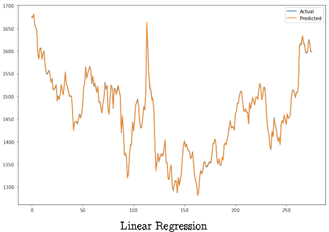
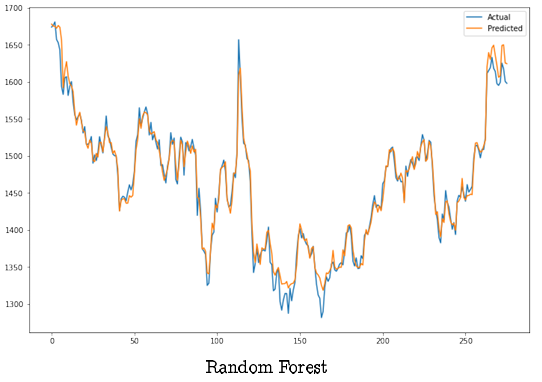
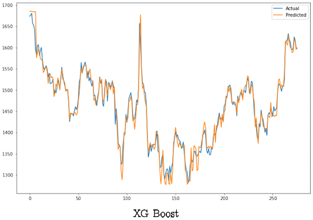

# **Abstract**
**Welcome to the project!  This section gives an overview of the project**

 In quantitative trading, stock prediction plays an important role in developing an effective trading strategy to achieve a substantial return. Also the prediction outcomes are the prerequisites for active portfolio construction and optimization. However, the stock prediction is a challenging task because of the diversified factors involved such as uncertainty and instability, sentiments of the traders and investors etc. Hence prediction of the stock prices are important to enter into the trade for which one of the most important part is extracting relevant features which can be used for forecasting. 
 
 In this project, we will be extracting various nancial features from the raw downloaded stocks data such as **Bollinger Bands**, **Rate-of-change (ROC)**,**Average Directional Index (ADX)**, **William's % R**, **Stochastic %K** and many others. After extracting various financial features we will move on to the prediction part in which we will be using Machine Learning models such as  **Linear regression**, **Random Forrest**, **XgBoost** and do a comparative study.
 Here, we downloaded and used real life stocks data of di erent domain on which we implemented several models.We choose five sectors namely **Cipla(pharmaceutical)**, **Coromandel(Agriculture)**, **HDFC Bank(Banking)**, **TCS(IT)**, **Bharat Petroleum(oil and petroleum)**.

 # **Downloading Data**
 To get started with the project, you need to download the necessary data files. The data for the Stocks specified above are downloaded through **Yahoo Finance** by the yahoo finance package in python. 
 
 For downloading the data for the stocks please go to [data extraction](https://github.com/srirup11/Prediction_of_multiple_stock_prices_using_features_from_technical_indicators/blob/main/codes/data%20extraction.ipynb)

 # **Feature Engineering**
 This section provides details on the technical indicators used as the features and some other features for prediction in the project. Technical indicators are mathematical calculations based on the price, volume, or open interest of a security or contract. For constructing the features please see [Feature Extraction](https://github.com/srirup11/Prediction_of_multiple_stock_prices_using_features_from_technical_indicators/blob/main/codes/Feature%20Extraction.ipynb) and covariate data for the stocks are saved in the folder [Preprocessed_data_of_stocks](https://github.com/srirup11/Prediction_of_multiple_stock_prices_using_features_from_technical_indicators/tree/main/Preprocessed_data_of_stocks) with the names as {Stock_name}_FINAL.csv e.g CIPLA_FINAL.csv.

# **Prediction**
This section gives an overview of the machine learning models used for the prediction purpose. After making the features, the last part of the project that remains is the prediction of the stock prices for which 3 machine learning models are used viz. Linear Regression, Random Forest Regression, Xgboost Regression.
* **Linear Regression:**
 Linear regression is a linear approach for modelling the relationship between a scalar response and one or more explanatory variables (also known as dependent and independent variables).

Please go to the code section: [Linear Regression Fitting](https://github.com/srirup11/Prediction_of_multiple_stock_prices_using_features_from_technical_indicators/blob/main/codes/Linear%20Regression%20Fitting.ipynb) 

* **Random Forest Regression:**
  Random Forest Regression is an ensemble method for the regression purpose. It consists of many decision trees giving the output or prediction which is the mean of the predictions from the decision trees. The hyperparameters used in the model are:
  - n estimators = 100 (Number of trees to fit)
  - max depth = 50 (Maximum tree depth of the decision trees)
  - random state = 42 (the seed to start)
 
Please go to the code section: [Random_Forest_Regression_Fitting](https://github.com/srirup11/Prediction_of_multiple_stock_prices_using_features_from_technical_indicators/blob/main/codes/Random_Forest_Regression_Fitting.ipynb)

* **XgBoost regression:**
   XgBoost regression is an ensemble method to do the supervised regression.It expects to have the base learners which are uniformly bad at the remainder so that when all the predictions are combined, bad predictions cancels out and better one sums up to form final good predictions. The hyperparameters used in the model are:
  - n estimators = 100 (Number of boosted trees to t)
  - max depth = 10 (Maximum tree depth for base learners)
  - learning rate = 0.2 (Boosting learning rate)
  - min child weight = 1 (Minimum sum of instance weight(hessian) needed in a child)

Please go to the code section: [XgBoost Regression Fitting](https://github.com/srirup11/Prediction_of_multiple_stock_prices_using_features_from_technical_indicators/blob/main/codes/XgBoost%20Regression%20Fitting.ipynb)

# **Evaluation Metrices**

* **MSE:**
 The Mean squared error (MSE) represents the error of the estimator or predictive model created based on the given set of observations in the sample. Intuitively, the MSE is used to measure the quality of the model based on the predictions made on the entire training dataset vis-a-vis the true label/output value. Mathematically, it is defined as:
 
$$
\text{MSE} = \frac{1}{n} \sum_{i=1}^{n} (y_i - \hat{y}_i)^2
$$

where, n is the total number of observations, y is the observed value and $\hat{y}$ is the predicted value. 

* **RMSE:**
  It is nothing but the square rooted version of the MSE. It is done to bring the error measure to the same unit as the observed values. That is, the RMSE is:

$$
\text{RMSE} = \sqrt {\frac{1}{n} \sum_{i=1}^{n} (y_i - \hat{y}_i)^2}
$$

# **Experimental Results**

<table>
  <thead>
    <tr>
      <th rowspan="2">Sectors</th>
      <th rowspan="2">Metrices</th>
      <th colspan="3">Models</th>
    </tr>
    <tr>
      <th>Random Forest Regression</th>
      <th>XgBoost Regression</th>
      <th>Linear Regression</th>
    </tr>
  </thead>
  <tbody>
    <tr>
      <td rowspan="2">HDFC</td>
      <td>MSE</td>
      <td>154.12</td>
      <td>237.85</td>
      <td>3.33</td>
    </tr>
    <tr>
      <td>RMSE</td>
      <td>12.41</td>
      <td>15.42</td>
      <td>1.82</td>
    </tr>
    <tr>
      <td rowspan="2">Bharat Petrolium</td>
      <td>MSE</td>
      <td>0.38</td>
      <td>0.59</td>
      <td>0.01</td>
    </tr>
    <tr>
      <td>RMSE</td>
      <td>0.62</td>
      <td>0.77</td>
      <td>0.12</td>
    </tr>
    <tr>
      <td rowspan="2">Cipla</td>
      <td>MSE</td>
      <td>4143.62</td>
      <td>4240.27</td>
      <td>1.21</td>
    </tr>
    <tr>
      <td>RMSE</td>
      <td>64.37</td>
      <td>65.12</td>
      <td>1.1</td>
    </tr>
    <tr>
      <td rowspan="2">Coromandel</td>
      <td>MSE</td>
      <td>4059.98</td>
      <td>3373.08</td>
      <td>1.75</td>
    </tr>
    <tr>
      <td>RMSE</td>
      <td>63.72</td>
      <td>58.08</td>
      <td>1.32</td>
    </tr>
    <tr>
      <td rowspan="2">TCS</td>
      <td>MSE</td>
      <td>13501.76</td>
      <td>1903.9</td>
      <td>14.19</td>
    </tr>
    <tr>
      <td>RMSE</td>
      <td>116.2</td>
      <td>43.63</td>
      <td>3.77</td>
    </tr>
  </tbody>
</table>

Now let us look at the plots for comparing the predictions given by the models for each of the stocks.

* **HDFC:**
  
  
  
  

  
  
* **Bharat Petroleum:**
  
* **Cipla:**
* **Coromandel:**
* **TCS:**

